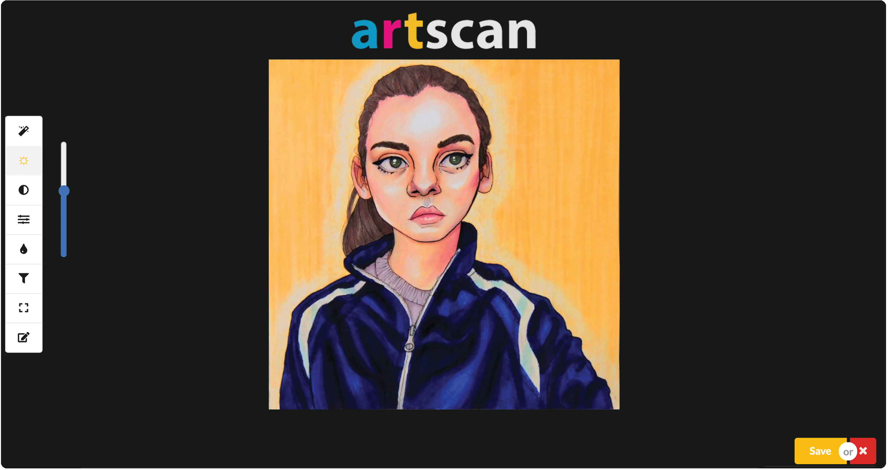

`npm start` (& `npm install`) 

Open [http://localhost:3000](http://localhost:3000) to view it in the browser.
 

  
Art Scan idea: An image processor targeted at traditional artists that will provide presets and tools to make art look professionally scanned without the use of a scanner.
  
How: Automate routines that an artist would go through in an image processor to enhance a photo of a drawing.
Combination of a scanner app, a simple image editor, and filter presets.
  

  
A screenshot of Art Scan in use after applying an automatic adjustment and tweaking the brightness:

